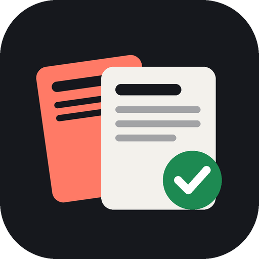

# SammeSak 📰

Støtt på en sak bak betalingsmur? SammeSak finner den samme saken hos nyhetssteder der den er gratis å lese.

**Åpne appen:** https://khalm.github.io/SammeSak/

## Slik virker det
1. **Del** en sak fra nettleseren og velg **SammeSak** – eller lim inn lenken eller overskriften i appen.
2. Appen finner overskriften og plukker ut de viktigste ordene (navn, steder, lange ord). Du kan slå ord av og på, legge til egne ord eller rette overskriften.
3. Den søker etter samme sak hos andre nyhetssteder og viser:
   - 🟢 **Gratis** – nettsteder som vanligvis er gratis (NRK, TV 2, BBC, Reuters …)
   - ⚪ **Ukjent** / 🟡 **Delvis betalingsmur** – kan være gratis (VG, Dagbladet, E24 …)
   - 🔒 **Betalingsmur** – skjult som standard
   - «✓ Trolig samme sak» når overskriftene ligner mye
4. Finner den ingenting, kan du trykke **Søk selv** (Google Nyheter, NRK, Bing, DuckDuckGo).

Appen omgår ikke betalingsmurer – den finner bare andre som har skrevet om det samme. Saker bare én avis har (egne avsløringer) finnes ofte ikke andre steder.

## Installer på telefonen (trengs for Del-menyen)
- **Android (Chrome):** åpne lenken → ⋮ → **Installer app**. Etterpå finner du SammeSak når du trykker **Del** på en sak.
- **iPhone (Safari):** Del → **Legg til på Hjem-skjerm**. iPhone støtter ikke Del-menyen for nettapper, så der kopierer du lenken og trykker **Lim inn** i appen.

## Publisering (én gang)
1. **Settings → Pages → Source: GitHub Actions**.
2. **Actions → Publiser appen → Run workflow** (skjer også automatisk ved hver endring).

## Valgfritt: bedre treff med gratis proxy
Uten noe oppsett søker appen i [GDELT](https://www.gdeltproject.org/) (gratis nyhetssøk fra hele verden). Med en gratis proxy på Cloudflare får du i tillegg:
- søk i **Google Nyheter** (mye bedre dekning av norske medier)
- ekte overskrift hentet fra lenken (ikke bare gjettet fra adressen)

Oppsett (kan gjøres på mobilen): følg stegene øverst i [`worker.js`](worker.js). Til slutt legger du adressen inn som secret `PROXY_URL` i repoet og kjører **Publiser appen** på nytt. Du kan også lime adressen inn under ⚙️ **Innstillinger → Avansert** i appen.

## Helt gratis
Ingen betalte tjenester, ingen nøkler, ingen innlogging. Historikk og innstillinger lagres bare på telefonen.

## Teknisk
Ren HTML/CSS/JavaScript uten byggesteg, hostet på GitHub Pages. Kan redigeres rett i GitHub på mobilen.
- `search.js` – nøkkelord, søk og poeng for hvor godt treffene passer
- `paywall.js` – listen over gratis/betalingsmur-nettsteder (utvid gjerne)
- `worker.js` – valgfri proxy (Cloudflare Workers)

Versjon vises øverst på forsiden.
